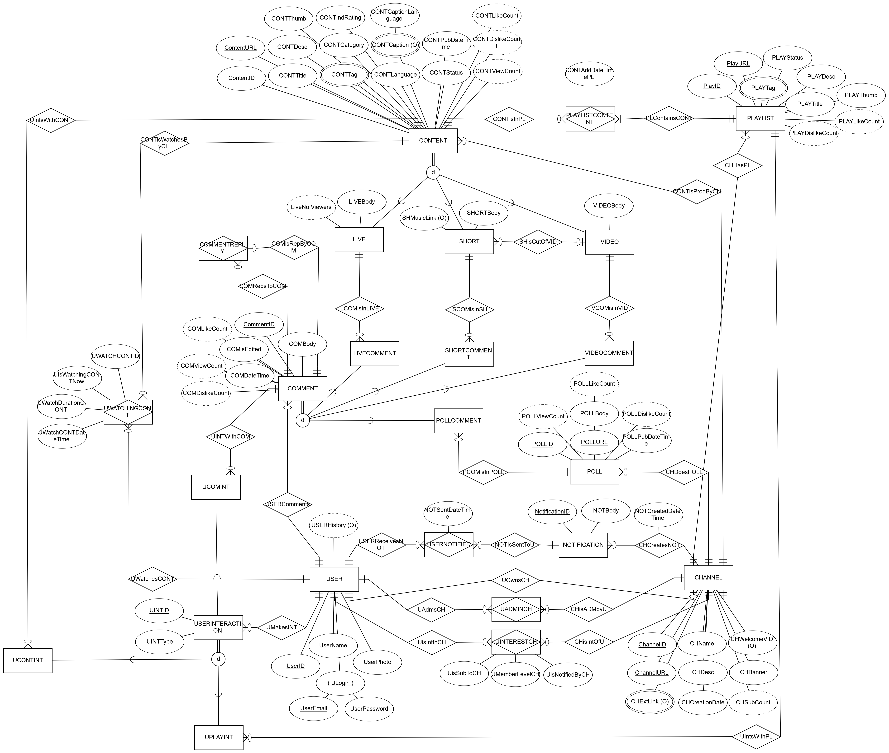
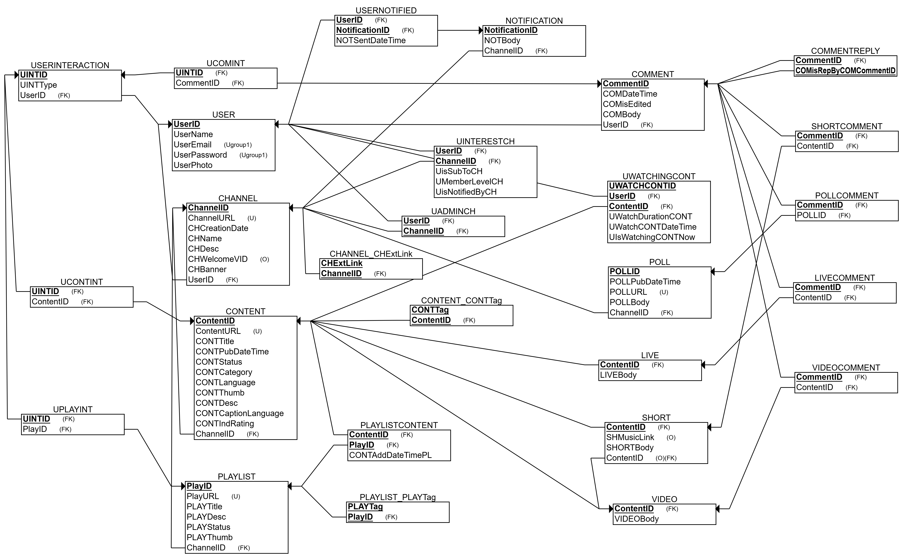

# Fase 2 do Projeto: Banco de Dados do YouTube (MIMI)

## O Que Foi Feito na Parte 2:

### 1. Revisão do Modelo ER para a 3ª Forma Normal (3FN)
Na Parte 2, foi realizada a revisão do modelo ER da Parte 1 para garantir que ele estivesse na **3ª forma normal (3FN)**. Este processo incluiu:
- **Eliminação de redundâncias**: Garantimos que os dados fossem normalizados, removendo duplicidades.
- **Eliminação de dependências transitivas**: Verificamos que todas as dependências de atributos estavam diretamente relacionadas à chave primária.
- **Normalização**: Distribuímos os dados em novas tabelas conforme necessário para evitar dependências indesejadas.

### 2. Diagrama Relacional
A partir do modelo ER revisado, geramos o **diagrama relacional**, que agora reflete a estrutura das tabelas e seus relacionamentos na 3FN. O modelo relacional apresenta as entidades como tabelas e as chaves primárias e estrangeiras para garantir a integridade referencial entre elas.

#### Principais Entidades

- `USER`, `CHANNEL`, `CONTENT`, `NOTIFICATION`
- `LIVE`, `VIDEO`, `SHORT`, `POLL`
- `COMMENT`, `COMMENTREPLY`, `USERINTERACTION`
- `PLAYLIST`, `PLAYLISTCONTENT`, `CONT_TAG`

#### Principais Relacionamentos

- **Usuário - Canal**: Um **usuário** pode ter **múltiplos canais** e ser **membro de múltiplos canais**. Além disso, o usuário pode ser **administrador de vários canais**.
- **Usuário - Conteúdo**: Um **usuário** pode visualizar **múltiplos conteúdos** (vídeos, shorts, lives), e cada **conteúdo** pode ser visualizado por **vários usuários**.
- **Canal - Conteúdo**: Um **canal** pode publicar **vários tipos de conteúdos** (vídeos, shorts, enquetes, etc.), e cada **conteúdo** é associado a **um único canal**.
- **Usuário - Notificação**: Um **usuário** pode receber **várias notificações**, que estão associadas a **conteúdos específicos** de **um canal** ao qual o usuário tenha ativado o sininho de notificações.
- **Usuário - Comentário**: Um **usuário** pode deixar **comentários** em **conteúdos**, e cada **comentário** pode ser respondido por outros **usuários** (relacionamento com **COMMENTREPLY**).
- **Conteúdo - Playlists**: Um **conteúdo** pode estar associado a **várias playlists**, e uma **playlist** pode conter **vários conteúdos**.
- **Conteúdo - Tag**: **Conteúdos** podem ter **várias tags** associadas, enquanto cada **tag** pode ser vinculada a **múltiplos conteúdos**.

#### **Diagrama ER atualizado**:

#### **Diagrama Relacional**:

### 3. Dados de Exemplo
Foram gerados dados fictícios para cada uma das tabelas, respeitando as regras de integridade referencial do banco de dados. Os dados de exemplo são fictícios e têm o objetivo de testar e demonstrar o funcionamento do banco. Alguns exemplos de dados foram criados para as tabelas **USER**, **CHANNEL**, **NOTIFICATION**, **CONTENT**, **PLAYLIST**, entre muitas outras. A planilha com esses dados pode ser encontrada nesta pasta no arquivo [**BD_Example_Data**](BD_Example_Data.xlsx).

### 4. Arquivos da Parte 2
A entrega da Parte 2 inclui os seguintes arquivos:

- **Apresentação.pdf** e **Apresentação.pptx**: A apresentação do projeto, que resume as etapas seguidas, as dificuldades enfrentadas, e os resultados alcançados.
- **BD_Example_Data.xlsx**: Planilha contendo os dados fictícios de exemplo organizados nas tabelas do banco de dados.
- **gerateTable.ipynb**: Script Jupyter utilizado para gerar os dados e exportá-los para o formato adequado.
- **image_ER.png**: Imagem do modelo ER atualizado, que representa visualmente o modelo conceitual do banco de dados.
- **image_Relational.png**: Imagem do modelo relacional, que representa as tabelas e seus relacionamentos.
- **MIMI_ER.erdplus**: Arquivo ERDPlus com
- **MIMI_.erdplus**: Arquivo ERDPlus com uma nova modelagem do banco de dados, contendo o modelo ER revisado e normalizado. O arquivo pode ser visualizado na ferramenta [ERDPlus](https://erdplus.com).
- **MIMI_Relational.erdplus**: Arquivo ERDPlus com o modelo relacional gerado a partir da revisão do modelo ER.
- **Requisitos.md**: Contém a lista completa e reestruturada dos requisitos do banco de dados, incluindo detalhes sobre as entidades e relacionamentos do sistema MIMI.

### 5. Dificuldades Encontradas
Durante a execução da Parte 2, algumas dificuldades foram enfrentadas, incluindo:
- **Complexidade das relações entre entidades**: A modelagem de entidades interligadas, como notificações e interações de usuários, exigiu bastante análise.
- **Limitações do ERDPlus**: A ferramenta ERDPlus apresentou limitações na implementação de alguns relacionamentos e na visualização de dados mais complexos.
- **Normalização para a 3ª forma normal**: Garantir que todas as dependências fossem devidamente tratadas na 3FN demandou um esforço significativo.

### 6. Considerações Finais
A Parte 2 do projeto foi focada na normalização do banco de dados, atualização do diagrama relacional e geração de dados fictícios para testes. Esta fase foi fundamental para garantir a integridade e eficiência do banco de dados, preparando o modelo para futuras implementações.

---

*Observação: Os dados gerados nesta fase são fictícios e têm como único propósito demonstrar o funcionamento do banco de dados no contexto do projeto MIMI.* 
